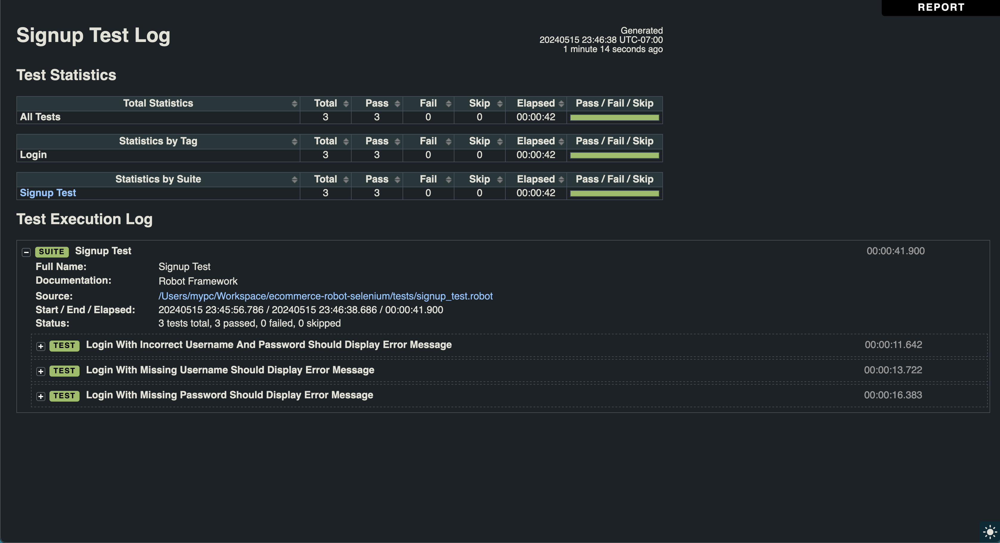

## 📊 Test Automation using Robot Framework
Test Automation project using Robot Framework, Python & Selenium.

## Technology Stack
This project utilizes a variety of tools to achieve its automation goals:
* [Robot Framework](https://robotframework.org/): A generic open source automation framework for acceptance testing, acceptance test driven development (ATDD), and robotic process automation (RPA).
* [Python](https://www.python.org/): The main programming language used for writing the test automation framework and tests.
* [PyCharm](https://www.jetbrains.com/pycharm/): An integrated development environment (IDE) used for writing and running the Python code.
* [Selenium](https://www.selenium.dev/): A tool for automating web browsers, used for writing the UI tests.

## Running Robot Framework DataDriver test
* Clone Repo: 			``git clone https://github.com/devtechmastery/ecommerce-robot-selenium.git``
* Install dependencies: ``pip install -r requirements.txt``
* Go into directory 	``cd  ecommerce-robot-selenium``
* Run Robot Framework:  ``robot --dryrun tests/signup_test.robot``
* Run Robot Framework:  ``robot -d results -i 'Login' tests/signup_test.robot``
* Run Robot Framework:  ``robot -d results -i 'Login' tests/signup_test.robot && open results/report.html && open results/log.html``

```
==============================================================================
Ecommerce-Robot-Selenium.Tests.Signup Test :: Robot Framework                 
==============================================================================
Login With Incorrect Username And Password Should Display Error Me... | PASS |
------------------------------------------------------------------------------
Login With Missing Username Should Display Error Message              | PASS |
------------------------------------------------------------------------------
Login With Missing Password Should Display Error Message              | PASS |
------------------------------------------------------------------------------
Ecommerce-Robot-Selenium.Tests.Signup Test :: Robot Framework         | PASS |
3 tests, 3 passed, 0 failed
==============================================================================
Output:  /Users/devtechmastery/Workspace/ecommerce-robot-selenium/results/output.xml
Log:     /Users/devtechmastery/Workspace/ecommerce-robot-selenium/results/log.html
Report:  /Users/devtechmastery/Workspace/ecommerce-robot-selenium/results/report.html
```


### Robot Framework Report 
